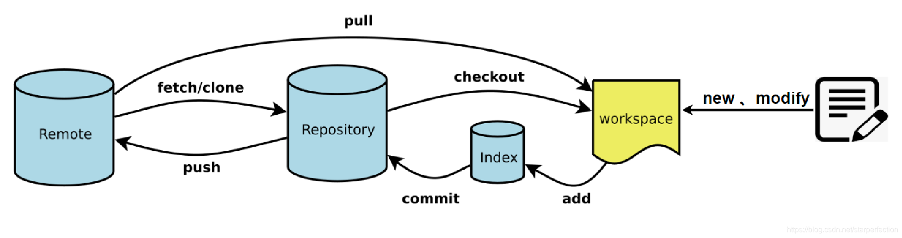
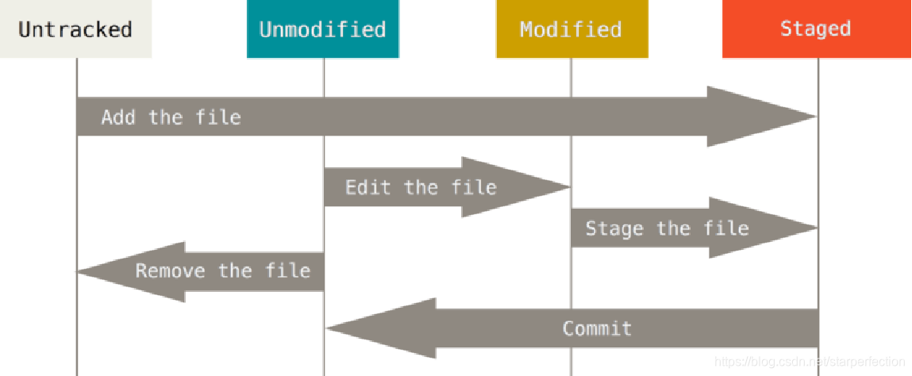

## Git基础

Git的核心是**版本控制**，能够有效地跟踪文件变化、协作开发，并存储项目的历史记录。其工作流程主要基于四个区域：

- **工作区**：git仓库文件夹中除了.git的文件/文件夹
- **暂存区**：.git文件夹中的index文件
- **（本地仓库）版本库**：.git文件夹里的一些东西
- **远程仓库**：Github仓库




### .git文件夹

在一个文件夹中执行`git init`后，会生成一个.git文件夹，一般来说有如下内容：

- objects目录：存储Git仓库中的所有对象。
- refs目录：
  - heads目录：存储分支引用，每个分支都对应一个文件，文件名与分支名称相同。这些文件中的内容是指向分支最新提交的指针。
  - tags目录：存储标签引用，每个标签都对应一个文件，文件名与标签名称相同。这些文件中的内容是指向标签的对象的指针。
  - remotes目录：存储远程引用，每个远程仓库都对应一个子目录，目录名与远程仓库名称相同。在每个远程仓库目录下，可以存储与该远程仓库相关的引用，如远程分支引用。
- index文件：二进制文件，即暂存区。
- HEAD文件：用于指示当前所在分支或提交。例如`ref:refs/heads/master`。
- config文件：存储仓库级别的配置选项。


### .gitignore

在任何当前工作的 Git 仓库中，每个文件都是这样的：

- **追踪的（tracked）**- 这些是 Git 所知道的所有文件或目录。这些是新添加（用 `git add` 添加）和提交（用 `git commit` 提交）到主仓库的文件和目录。
- **未被追踪的（untracked）** - 这些是在工作目录中创建的，但还没有被暂存（或用 `git add` 命令添加）的任何新文件或目录。
- **被忽略的（ignored）** - 这些是 Git 知道的要全部排除、忽略或在 Git 仓库中不需要注意的所有文件或目录。本质上，这是一种告诉 Git 哪些未被追踪的文件应该保持不被追踪并且永远不会被提交的方法。



所有被忽略的文件都会被保存在一个 `.gitignore` 文件中，该文件被存放于仓库的根目录下，示例：

```shell
# 忽略位于根目录下的 text.txt 文件
/text.txt

# 忽略一个位于根目录下的 test 目录中的 text.txt 文件
/test/text.txt

# 忽略任何 text.txt 文件
text.txt

# 忽略整个目录
test/

# 忽略所有名称以 img 开头的文件和目录
img*

# 忽略所有 .md 文件
.md

# 不忽略 所有README.md 文件，但如果你忽略了其所属的整个目录，这个模式就不起作用
!README.md
```


Git 只能忽略尚未提交到仓库的未被追踪的文件，所以如果需要忽略已经被追踪的文件，需要一行命令`git rm --cached <file>`

> [.gitignore 文件——如何在 Git 中忽略文件和文件夹 (freecodecamp.org)](https://www.freecodecamp.org/chinese/news/gitignore-file-how-to-ignore-files-and-folders-in-git/)


## 命令

对于所有命令，均可通过`--help`选项查看官方文档，例如`git commit --help`。

### clone & config & branch & checkout 

`clone`用于将远端仓库拉取到本地。

```shell
# 默认分支名为master
git clone <remote-repo-url> [relative_path_to_curpath]
# 指定分支名
git clone -b <default_branch_name> <remote-repo-url> [relative_path_to_curpath]
```

git仓库拉取完毕后第一件事就是设置git配置项。

```shell
# 查看所有配置项
git config --list
git config -l

# 查看某一项配置
git config user.name

# 配置项设置与取消设置
git config [--global] user.name "runoob"
git config [--global] user.email test@runoob.com
git config [--global] --unset user.name
git config [--global] --unset user.email
```

> Github会根据本地git仓库的配置项user.email，从而判定提交的Github账户。

`branch`是**指向某个 commit 的指针**， 可以移动，**HEAD**指向当前分支的最新节点。

```shell
# 查看本地分支
git branch
# 查看远程分支
git branch -r
# 查看所有分支（本地和远程）
git branch -a

# 新建分支
git branch <local_branch_name>
# 切换分支
git checkout <local_branch_name>
# 创建并切换分支
git checkout -b <local_branch_name>

# 删除本地分支
git branch -d <local_branch_name> 
# 删除远程分支，2种方式
git push origin --delete <remote_branch_name> 
git push origin :<remote_branch_name> 
```

`checkout`（检出）不仅可以用于创建切换分支，还可以用于从版本库中检出版本或文件到工作区，从`<src_branch>`检出文件或文件夹到工作区，以达到复制文件或文件夹到`<dest_branch>`的目的：

```shell
git checkout <dest_branch>
git checkout <src_branch> -- file_name1 [file_name...]
git checkout <src_branch> -- folder_name1 [folder_name...]
```


###  add & commit & push & pull

`add`：

```shell
# 添加一个或多个文件到暂存区
git add [file1] [file2] ...
# 添加指定目录到暂存区，包括子目录
git add [dir]
# 添加当前目录下的所有文件到暂存区
git add .
```

`commit`：

```shell
# 提交到本地仓库
git commit -m "commit_message"
# 提交暂存区的指定文件到仓库区
git commit [file1] [file2] ... -m [message]
# 提交暂存区到本地仓库中
git commit -m [message]

# 并入上一次提交，这命令很有用
# 1. 可以修改提交信息
# 2. 可以修改提交时间
git commit --amend
# 不修改提交信息
git commit --amend --no-edit
```

`push`：

```shell
# 将local_branch_name推送到remote_branch_name
git push <remote_repo> <local_branch_name>：<remote_branch_name>
# 推送到同名的远端分支
git push <remote_repo> <local_branch_name>
# 等价于 git push origin <cur_branch_name>:<cur_branch_name>
git push

# 可通过-f选项实现强推
```

`pull`：

`pull` = `fetch` + `merge`

`pull --rebase` = `fetch` + `rebase`

```shell
# 将 remote_branch_name 拉取到 local_branch_name
git pull <remote_repo> <remote_branch_name>：<local_branch_name>
# 拉取到同名的近端分支
git pull <remote_repo> <remote_branch_name>
# 等价于 git pull origin <cur_branch_name>:<cur_branch_name>
git pull

# --rebase是否在merge时使用变基
```


工作流：

- `clone`
- 从`master` 通过`checkout`拉一个自己的分支
- 开发
- `add + commit`
- `git log --oneline`检查提交
- `push`


### tag

Git 的标签虽然是版本库的快照，但其实它就是**指向某个 commit 的指针**（跟分支很像，但是分支可以移动，**标签不能移动**），所以，创建和删除标签都是瞬间完成的。
tag就是一个让人容易记住的有意义的名字，它跟某个commit绑在一起。


```shell
# tag可作为commit-id来使用
git tag -a <tagname> -m "runoob.com标签"
git tag -d v1.1
git tag
git show v1.0
```

### cherry-pick

```cpp
git remote add origin_24A https://szv-y.codehub.huawei.com/WN_BoardSoftware/BoardSoftware_24A_Trunk.git
git fetch origin_24A
// 执行cherry-pick
git cherry-pick [-e] commit-id-of-24A  // 可修改提交信息
有冲突就解决冲突
// 如果解决不了冲突，就需要使用下行退回到cherry-pick前的状态
git cherry-pick --abort
```


### rebase


```shell
git rebase [-i] <base>
# 当前分支 以 <base> 为起点
# <base> refers to the branch(HEAD) or commit to rebase the current branch onto.
```

rebase用法:

- 合并中间连续多个提交：

```shell
git rebase -i 最早的合并提交的前一个
# git log显示的commit从上到下， 是时间从近到远
# git rebase -i 显示的commit从上到下， 是时间从远到近
看选项，用s或f都行
```

- 删除某些提交：

```shell
# base 为基准commit， 显示出来可操作的commit范围为(base,HEAD]
git rebase -i <base>
# git log显示的commit从上到下， 是时间从近到远
# git rebase -i 显示的commit从上到下， 是时间从远到近
用d就行
```

- 更新修改基于的分支：
  feature分支基于master分支进行修改，新增commit。然而master分支也新增了commit的情况：正确的操作是先提前将 master 主分支的新代码 rebase 到自己的分支，再在主分支上 merge 自己的分支。

```shell
# 在master以外的其他分支上
git fetch origin master
git rebase origin/master
# 或者等价于
git pull master --rebase


# 合入阶段: 切换到master 执行git merge feature


# git pull=git fetch + git merge
# git pull --rebase=git fetch+git rebase
```


rebase 解决冲突：

```shell
先解决冲突 再保存
git add .
git rebase --continue
```

### reset

`reset`命令就是在移动`HEAD`指针。`HEAD`表示当前工作区的版本，它是一个指针，指向commit tree上的一个节点。

```shell
git reset [--soft | --mixed | --hard] <head>
```

可选参数：

- **mixed** ，默认方式，用于重置暂存区的文件与上一次的提交(commit)保持一致，工作区文件内容保持不变。
- **soft** ， 用于回退到某个版本，暂存区和工作区都不变。
- **hard** ，撤销工作区中所有未提交的修改内容，将暂存区与工作区都回到上一次版本，并删除之前的所有信息提交

head 说明： 可以使用commitId，也可以使用如下两种方式：

- HEAD 表示当前版本
- HEAD^ 上一个版本
- HEAD^^ 上上一个版本
- HEAD^^^ 上上上一个版本
- 以此类推…

可以使用 ～数字表示

- HEAD~0 表示当前版本
- HEAD~1 上一个版本
- HEAD^2 上上一个版本
- HEAD^3 上上上一个版本
- 以此类推…


### fetch & merge

``git fetch`` 下载了远端的内容，但也不会更新你本地仓库的版本状态

```shell
# fetch仓库中所有分支。同时也会下载指定远端的所有commits和文件。
# 未指定<remote-repo>的话，使用origin
git fetch <remote-repo>
# 与上同，只fetch指定分支
git fetch <remote-repo> <remote-branch>

# 本地重置为某远程分支的代码
git fetch origin <remote_branch_name>
git reset --hard origin/feature/br_calib_carrComp_1206

# 当本地有其他分支的代码仓库时
# 1. 新建本地分支，并切换，并和远程分支建立映射关系
git checkout -b 本地分支名xxx origin/远程分支名xxx
# 2. 新建本地分支，不切换，不和远程分支建立映射关系
git fetch origin 远程分支名xxx:本地分支名xxx
```

`git pull` 等价于`git fetch` + `git merge`，

```shell
# 如果有冲突，就必须解决，没有回头路了
(master) git pull origin master:master
# 等价于下面两行
(master) git fetch origin master
(master) git merge origin/master

# 如果冲突，不想合并了，可以执行 git merge --abort 恢复原状
```

> [[GIT\] master、origin master 与 origin/master 有什么区别？ - 陪她去流浪 (twofei.com)](https://blog.twofei.com/695/)
>
> 总结 在Git中，origin/master 和 origin master 代表不同的分支。 
>
> - master表示本地的某个分支名
> - origin/master 是一个本地分支，用于跟踪与远程仓库的 master 分支相关联的更新，是从远程拉取代码后在本地建立的一份拷贝。 
> - origin master 是一个远程分支，表示远程仓库的子分支，用于推送和比较本地分支的更新。
>
> 如果origin master分支更新了， 而没有执行``git fetch origin master``，则origin/master将不是最新状态。

### stash

``git stash``适用于有一些小改动但又不想提交的场景。该命令将当前未提交的修改(即，工作区的修改和暂存区的修改)先暂时储藏起来，这样工作区干净了后，就可以切换到master分支下拉一个fix分支。在完成线上bug的修复工作后，重新切换到dev分支下通过**git stash pop**命令将之前储藏的修改取出来，继续进行新功能的开发工作


```shell
# 当前暂存区、工作区的修改储藏来实现清空工作区
git stash
# 取出最近一次储藏的修改到工作区、暂存区中，并同时将该储藏从储藏记录列表中删除
git stash pop


# 多次存储，进阶使用
# 标记此次储藏
git stash save [stashMessage]
# 取出指定index的储藏的修改到工作、暂存区中
git stash apply stash@{index} 
# 将指定index的储藏从储藏记录列表中删除
git stash drop stash@{index}
# 查看所有储藏
git stash list

```


### diff

- `git diff` 显示的是你的工作目录和暂存区的变化之间的差异。
- `git diff --staged` 命令，它列出了**暂存区域**和你最后**一次提交**之间的变化。
- `git diff HEAD` 命令，将已暂存和未暂存的修改与你的最后一次提交进行比较。
- `git diff <branch_name1> <branch_name2>` 命令来比较第一个分支的改动和第二个分支的改动。
- `git diff <commit_hash> <commit_hash>` 命令来比较两个提交之间的变化

上述命令都可以加个[<file_path>]， 只比较特定文件

显示结果：

- a版本，是前一个版本，红色，以 -开头 
- b版本，是后一个版本，绿色，以 +开头

> [Git diff 命令——如何比较你的代码中的变化 (freecodecamp.org)](https://www.freecodecamp.org/chinese/news/git-diff-command/)

### submodule

git中的子模块也是一个独立的git仓库，常用操作：

```shell
# 添加子模块
git submodule add <submodule_url>

# 获取子模块
git clone {main_repo_url} --recurse-submodules
# 与上等价
git submodule init;git submodule update


# 更新子模块
cd project-sub-1;git pull origin master
# 与上等价
git submodule foreach 'git pull origin master'

# 删除子模块
git submodule deinit project-sub-1;git rm project-sub-1
```

> [Git中submodule的使用 - 知乎 (zhihu.com)](https://zhuanlan.zhihu.com/p/87053283)


### rm

```shell
# 删除工作区的文件
rm <file>
# 将文件从暂存区和工作区中删除
git rm -f <file>
# 从暂存区域移除，但希望保留在工作区
git rm --cached <file>

# 删除工作区的文件
rm <file>
# 将文件从暂存区和工作区中删除
git rm <file> [-f]
# 从暂存区域移除，但希望保留在当前工作目录
git rm --cached <file>shell
