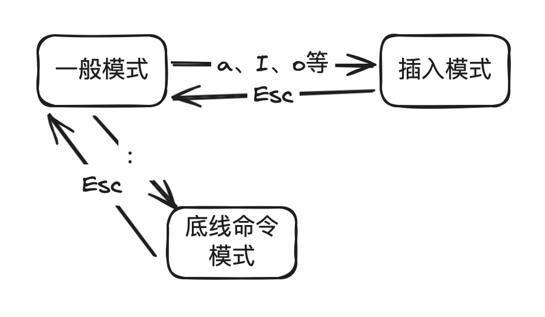

## 模式

Vim的核心在于**模式切换**，一共有如下四种模式：

- 一般（命令）模式：此模式下敲击键盘动作会被 Vim 识别为命令，只有基本命令
- 插入模式：此模式下敲击键盘动作会被 Vim 识别为输入字符
- 底线命令模式：更多的命令需要通过`:`进行底线命令模式执行



> 可视模式：选中文本，类似于鼠标拖选

## 语法

一般模式下，Vim语法是`verb + noun`，可扩展为：

- **[number] + operator + motion**：如 `5dw` `3fe`
- **operator + [number] + motion**：如 `d5w`
- **operator + text_object_scope + text-object**：如`dip`、`yap`

> `[number]`表示可选，`number`的值代表重复`operator`的次数，`3fe`等价于`fefefe`
>
> Vim更推崇重复而非数数，需要利用好`.`，其作用是重复上一次的修改操作，这个修改操作是指：
>
> - 对字符做了更新（增删改）：如 `d`、`c`、`x` 之类的
> - 离开插入模式之前的按键组合
>
> ---
>
> `text_object_scope + text-object` 一起使用可作为`noun`

其中：

- **operator**：增删改查等操作

  - `y`，yank 复制
  - `p`，paste 粘贴
  - `d`， delete 删除，将删除的文本存到寄存器中
  - `c`，change 删除文本，将删除的文本存到寄存器中，进入插入模式
  - `x`，删除
  - `f`，find查找
  - 等等

- **motion**：字符范围

  - `h` 、`j` 、`k`、 `l`
  - `gg`、`G`
  - `0`、`$`
  - `e`、`ge`、`b`、`w`
  - 等等

- **text-object**：在 Vim 中，文本是结构化的存在，即 **文本对象**。

  - `(` 或 `)` ：一对 `()`
  - `b` ：一对 `()`
  - `{` 或 `}` ：一对 `{}`
  - `B` ：一对 `{}`
  - `[` 或 `]` ：一对 `[]`
  - `<` 或 `>` ：一对 `<>`
  - `t` ：tag （HTML 或 XML）标签
  - `'`  ：一对 `''`
  - `"`  ：一对 `""`
  - \`  ：一对 \`
  - `w` ：一个单词
  - `s` ：一个句子；以 `.` `!` `?` 结尾即为一个句子
  - `p` ：一个段落；以一个换行符间隔即为一个段落

- **text_object_scope**：配合文本对象使用，也算是一种**motion**

  - 内部：`i` ，意指 inner，**内部文本对象**选中的部分不包含包围文本对象的空白或括号等
  - 外部：`a` ，英文单词 a，**外部文本对象**则包括了包围内容的空白或括号等对象

  > 如果你的光标位于一对括号内部，例如`(hello Vim)`中：
  >
  > - 删除括号内部的内容但保留括号：`di(`
  > - 删除括号以及内部的内容：`da(`

---

可视模式下：

- 字符可视化模式（Characterwise visual mode）：文本选择是以字符为单位，命令 `v` （命令模式下），再次按下即退出
- 行可视化模式（Linewise visual mode）：文本选择是以行为单位，命令 `V` （命令模式下），再次按下即退出

---

底线命令模式：一般模式下输入`:`

- `wq`
- `q`
- `w <file_path>`
- `q!`
- 等等

---

插入模式下没啥说的，文本输入完成后切换到一般模式。


## 命令


### 查找

**一般模式**下：

- **文档中查找**：重复`n`、逆转`N`
  - **从前往后**查找：`/模式`
  - **从后往前**查找：`?模式`
  - 查看搜索历史：`/ + 上下方向键`
- **行中查找**：重复`;`、逆转`,`
  - **从前往后**查找一个字符：
    - 光标移动到目标字符：`f{char}`
    - 光标移动到目标字符的**前**一个字符（按查找顺序）：`t{char}`
  - **从后往前**查找一个字符：
    - 光标移动到该字符：`F{char}`
    - 光标移动到该字符的**前**一个字符（按查找顺序）：`T{char}`


### 替换

**底线命令**模式下：

- 在一行内**替换头一个**字符串 old_content 为新的字符串 new_content：`:s/<old_content>/<new_content>`
- 在一行内**替换所有**的字符串 old_content 为新的字符串 new_content：`:s/<old_content>/<new_content>/g`
- 在**[start, end]行**内替换所有的字符串 old_content 为新的字符串 new_content：`:{start},{end}s/<old_content>/<new_content>/g`
- 在**文件内**替换所有的字符串 old_content 为新的字符串 new_content：`:%s/<old_content>/<new_content>/g`
- 进行全文替换时**询问用户确认**每个替换需添加 c 标志：`:%s/<old_content>/<new_content>/gc`


### 多文件与多窗口跳转


**多文件跳转**：

- `gd` ： 跳转到定义
- `ctrl` + `i`：跳转到 jump list 的后一个记录
- `ctrl` + `o`：跳转到 jump list 的前一个记录


**标记**：

- `'` ：跳转到标记的⾏
- ` ：跳转到标记的位置(⾏和列)
- `m` + [小写字母]：只可在单个文件内跳转的标记；后面的为标记的标识符，用于跳转的指向；可以理解为当前标记的名字；下同
- `m` + [大写字母]：可在多个文件之间跳转的标记
- `:marks`：查看所有标记
- `:delmarks a`：清除标记a
- `:delmarks!`：清除所有标记


**标签页**：

- `gt`： 跳转到下一个标签页，go to next tab
- `gT`： 跳转到上一个标签页
- `2gt`：跳转到标签页2


**多窗口**：

- `:sp`：从当前窗口分割出一个水平窗口
- `:vsp`：从当前窗口分割出一个垂直窗口
- 窗口间的移动：
  - 移动到左方窗口：`<C-w>`,`<C-h>`
  - 移动到下方窗口：`<C-w>`,`<C-j>`
  - 移动到上方窗口：`<C-w>`,`<C-k>`
  - 移动到右方窗口：`<C-w>`,`<C-l>`


## vscode vim配置

VSCodeVim插件官方地址：[GitHub - VSCodeVim/Vim: :star: Vim for Visual Studio Code](https://github.com/VSCodeVim/Vim)

自用配置：

```json
	// 设置相对行号
    "editor.lineNumbers": "relative",
    // 绑定vim前导键
   "vim.leader": "<space>",
   // 启用系统粘贴板作为vim寄存器
   "vim.useSystemClipboard": true,
   // 突出显示与当前搜索匹配的所有文本
   "vim.hlsearch": true,
    // 按键映射
    // 普通模式下的非递归按键绑定
   "vim.normalModeKeyBindingsNonRecursive": [
        // jump list跳转
        {
            "before": ["g", "o"],
            "after": ["<C-o>"]
        },
        {
            "before": ["g", "i"],
            "after": ["<C-i>"]
        },
        // 窗口移动
        {
            "before": ["<leader>", "w", "h"],
            "after": ["<C-w>","<C-h>"]
        },
        {
            "before": ["<leader>", "w", "j"],
            "after": ["<C-w>","<C-j>"]
        },
        {
            "before": ["<leader>", "w", "k"],
            "after": ["<C-w>","<C-k>"]
        },
        {
            "before": ["<leader>", "w", "l"],
            "after": ["<C-w>","<C-l>"]
        },

        // vscode快捷键映射, commands值的获取：设置 - 键盘快捷方式 - 在对应命令右键后选择 [复制命令 ID]
        {
            "before": ["<Leader>", "h"],
            "commands": ["highlightSelected.highlight.addHighlight"] 
        },
        {
            "before": ["<Leader>", "t"],
            "commands": ["editor.toggleFold"] 
        },
   ],
    // 插入模式下的非递归按键绑定
    "vim.insertModeKeyBindings": [
            {
                "before": ["j", "j"],
                "after": ["<Esc>"]
            }
    ],
    // 命令模式下的非递归按键绑定
    "vim.commandLineModeKeyBindingsNonRecursive": [],
    // 可视模式下的非递归按键绑定
    "vim.operatorPendingModeKeyBindings": [],

    // 下面定义的按键将交由vscode进行处理，而不是vscode-vim插件
    "vim.handleKeys": {
        "<C-c>": false,
        "<C-v>": false,
        "<C-f>": false,
        "<C-x>": false,
        "<C-a>": false,
        "<C-z>": false,

    },
	// <C-c>
	// <A-f>
	// <Esc>
```


不错的Vim学习网站：

- [Vim Cheat Sheet (rtorr.com)](https://vim.rtorr.com/)
- [Vim Cheat Sheet & Quick Reference](https://quickref.me/vim.html)
- [Just Vim it](https://vim.nauxscript.com/)
